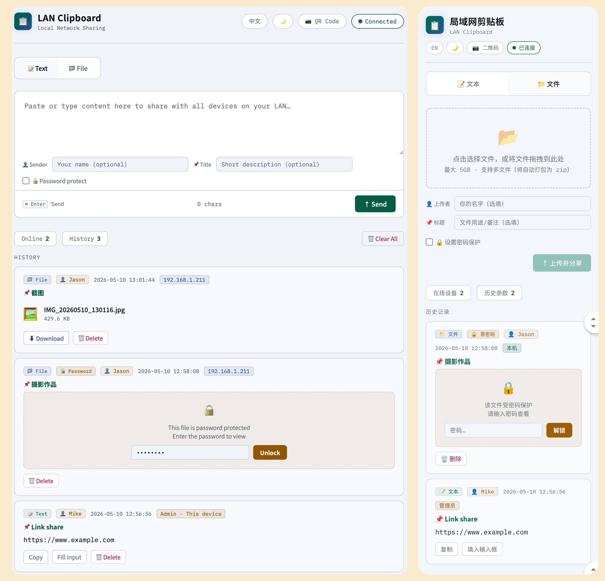
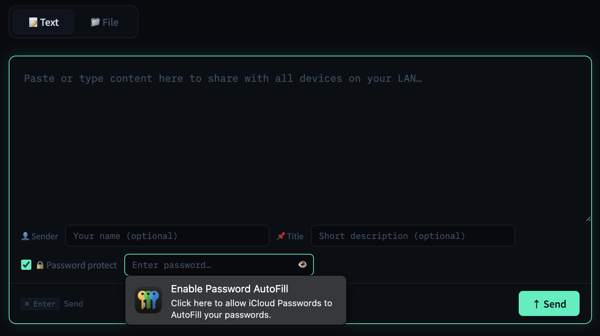
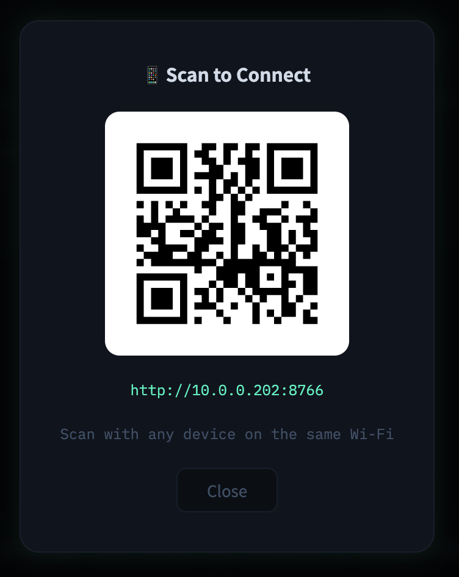

# LAN Clipboard · 局域网剪贴板

> Share text and files instantly across all devices on your local network — no internet, no accounts, no apps required.
>
> 在局域网内跨设备即时共享文本与文件，无需互联网、无需账号、无需安装 App。




---

## Features · 功能特性

- **Real-time sync** — WebSocket broadcasts new content to all connected devices instantly  
  实时同步，新内容通过 WebSocket 即时推送到所有在线设备
- **Text & file sharing** — paste text or upload files up to 5 GB  
  文本与文件共享，单文件最大 5 GB
- **Multi-file upload** — multiple files are auto-packaged into a zip  
  多文件自动打包为 zip 上传
- **Password protection** — lock individual items; auto-relocks after 60 s  
  单条目密码保护，解锁后 60 秒自动重新锁定
- **QR code access** — scan to open on any phone on the same Wi-Fi  
  内置二维码，手机扫码一键访问
- **Fine-grained delete permissions** — public entries can be deleted by anyone; password-protected entries require the creator, admin, or a user who has unlocked the entry  
  细粒度删除权限：公开条目任何人可删；加密条目仅创建者、管理员或已输入正确密码的用户可删
- **Admin controls** — the host machine can delete any entry or clear all history  
  主机拥有管理员权限，可删除任意条目或清空全部历史
- **Bilingual UI** — switch between Chinese and English with one click  
  中英文界面一键切换
- **Zero client dependencies** — works in any modern browser, no app needed  
  客户端零依赖，任何现代浏览器均可使用

| Text sharing · 文本共享 | File upload · 文件上传 |
|:-:|:-:|
|  |  |

| Password protection · 密码保护 | QR code access · 二维码访问 |
|:-:|:-:|
|  |  |

---

## Quick Start · 快速启动

### Requirements · 环境要求

- Python 3.9+
- All devices on the **same local network** (Wi-Fi or wired)  
  所有设备接入**同一局域网**（Wi-Fi 或有线）

### One-click start (macOS / Linux) · 一键启动

```bash
git clone https://github.com/YOUR_USERNAME/lan-clipboard.git
cd lan-clipboard
chmod +x start.sh
./start.sh
```

The script creates a virtual environment, installs dependencies, and starts the server.  
脚本自动创建虚拟环境、安装依赖并启动服务器。

### Manual start · 手动启动

```bash
pip install -r requirements.txt
python3 server.py
```

Open the printed URL (e.g. `http://192.168.1.x:8766`) in a browser on **any device** in your network.  
用局域网内**任意设备**的浏览器打开终端输出的地址（如 `http://192.168.1.x:8766`）即可。

---

## Usage · 使用方法

| Action · 操作 | How · 方式 |
|---|---|
| Send text · 发送文本 | Text tab → type/paste → **Send** or **⌘/Ctrl + Enter** |
| Share a file · 分享文件 | File tab → drag & drop or click → **Upload & Share** |
| Copy text · 复制文本 | Click **Copy** on any text entry |
| Download a file · 下载文件 | Click **Download** on any file entry |
| Password protect · 密码保护 | Enable the lock toggle before sending |
| Switch language · 切换语言 | Click **EN / 中文** in the top-right corner |
| Delete an entry · 删除条目 | Click **Delete** → confirm inline (public: any user; locked: creator / admin / unlocked user) |
| Clear all · 清空全部 | Click **Clear All** (admin / host only) |
| Mobile access · 手机访问 | Click **QR Code** → scan with phone |

---

## How It Works · 工作原理

```
Browser  ←── WebSocket :8765 ──→  Python Server  ←── HTTP :8766 ──→  Browser
                                        │
                                   uploads/  (files stored here)
```

| Port | Protocol | Purpose |
|------|----------|---------|
| 8766 | HTTP | Web UI · File upload/download · QR code |
| 8765 | WebSocket | Real-time text sync · Password verify · Event broadcast |

---

## Configuration · 配置

Edit the constants at the top of `server.py`:

| Variable | Default | Description |
|----------|---------|-------------|
| `HTTP_PORT` | `8766` | Web UI port |
| `WS_PORT` | `8765` | WebSocket port |
| `MAX_FILE_SIZE` | `5 GB` | Maximum file size |
| `MAX_TEXT_SIZE` | `1 MB` | Maximum text size |
| `MAX_HISTORY` | `50` | History limit (oldest auto-evicted) |

---

## Security Notes · 安全说明

- Designed for **trusted local networks only**. Do not expose ports to the internet.  
  仅适用于**可信局域网**，请勿将端口暴露至互联网。
- Passwords are SHA-256 hashed in the browser before transmission; the server stores only the hash.  
  密码在浏览器端 SHA-256 哈希后传输，服务器仅存储哈希值。
- The machine running the server is the **admin** and can manage all entries.  
  运行服务器的机器为**管理员**，可管理所有条目。

---

## License · 许可证

MIT

---

## Changelog · 更新日志

### v0.3.2 — 2026-05-14

**UI polish · 交互动效**
- Active tab indicator now slides between Text / File with a cubic-bezier transform instead of jumping. Tab content fades + translates in on switch  
  Text / File 切换时活跃指示器使用平移过渡（cubic-bezier），不再瞬切；面板内容淡入并轻微平移
- Inline delete confirm row slides in from the right with a short fade  
  内联删除确认按钮自右侧平移淡入
- Language toggle plays a brief dim-and-restore fade so the text swap doesn't feel like a flicker  
  中英文切换时整页轻微淡出再淡入，文本替换不再突兀
- Toasts now have an exit animation and an adaptive lifetime (2 s for short messages, scaling up to 6 s for long ones) so users have time to read longer notices  
  Toast 增加退出动画，并根据文本长度自适应停留时间（2 秒到 6 秒），长提示有充足阅读时间

**Friendlier wording · 文案优化**
- Replaced the technical `E2E` terminology in user-facing UI. The badge now reads `🔐 完全加密` / `🔐 Encrypted`, lock descriptions tell users plainly that the host cannot view the content, and fallback toasts say "using password protection (host can view content)" instead of mentioning the E2E acronym  
  用户界面中的 `E2E` 技术术语已替换为更友好的描述：徽章改为 `🔐 完全加密`，锁定提示直接告诉用户「主机也无法查看」，回退提示改为「使用普通密码保护（主机可查看内容）」

---

### v0.3.1 — 2026-05-14

**Bug fixes · 问题修复**
- Password-protected text and small-file uploads no longer fail silently on plain HTTP LAN addresses. The Web Crypto API requires a secure context (HTTPS / `localhost`), so E2E mode now detects an insecure context up front and gracefully falls back to the legacy access-control path with a clear toast notification  
  在普通 HTTP 局域网地址下，加密文本与小文件上传不再静默失败。Web Crypto 仅在安全上下文（HTTPS / `localhost`）可用，E2E 现在会提前检测并自动回退至访问控制模式，并通过提示告知用户

**Performance · 性能优化**
- E2E file downloads no longer re-derive the AES key. The CryptoKey produced at unlock is cached for the rest of the session, eliminating a second 100k-iteration PBKDF2 (~100–300 ms per download)  
  E2E 文件下载不再重复推导密钥，解锁时生成的 CryptoKey 会缓存到会话结束，省去第二次 PBKDF2（每次下载 ~100–300 ms）
- E2E file uploads run PBKDF2 and the file read in parallel, and the plaintext buffer is released as soon as encryption completes  
  E2E 文件上传将 PBKDF2 推导与文件读取并行执行，加密结束后立即释放明文缓冲，峰值内存更低

**Code quality · 代码质量**
- Crypto helpers split into a small key-derivation step plus key-based encrypt/decrypt, so callers can derive once and reuse  
  加密辅助函数拆分为密钥推导与基于密钥的加解密两层，调用方可推导一次后复用
- Server-side `download_handler` and `push` / `upload_handler` branches consolidated; removed the `pass`-placeholder smell and the WHAT-restating comments  
  服务端 `download_handler` 与 `push` / `upload_handler` 分支合并，移除占位 `pass` 与冗余注释
- Plaintext is cleared from in-memory entries on relock; lock-badge rendering deduplicated via a shared helper  
  重锁时清除已缓存的明文；锁定徽章渲染抽出公共方法

---

### v0.3.0 — 2026-05-14

**E2E encryption · 端对端加密**
- All password-protected text entries are now E2E encrypted in the browser using PBKDF2 (100k iterations) + AES-256-GCM; the server stores only ciphertext + salt + iv — no password hash, no plaintext  
  所有加密文本条目现在在浏览器中端对端加密（PBKDF2 + AES-256-GCM），服务器仅存储密文及 salt/iv，不存储密码哈希或明文
- Single files ≤ 100 MB with a password are also E2E encrypted before upload; the server stores only the encrypted blob  
  密码保护的单文件（≤100MB）上传前在浏览器中加密，服务器仅存储密文
- Files > 100 MB or multi-file uploads with a password fall back to the existing access-control model; a toast notification informs the user  
  超过 100MB 或多文件上传带密码时，回退至原有的访问控制模型，并通过提示告知用户
- Decryption is entirely client-side: wrong password = decrypt failure (no server round-trip)  
  解密完全在客户端进行，密码错误立即反馈，服务器不参与密码校验
- E2E entries display a distinct `🔐 E2E` badge (indigo) instead of the regular `🔒 Password` badge  
  E2E 条目显示独立的蓝紫色 `🔐 E2E` 徽章，与普通密码保护区分
- Delete permission for E2E entries is restricted to creator + admin (server cannot verify password ownership)  
  E2E 条目的删除权限限于创建者和管理员（服务器无法验证密码归属）

---

### v0.2.1 — 2026-05-14

**Bug fixes · 问题修复**
- Password input is now cleared when an entry relocks, so the previous password is no longer visible after auto-relock  
  自动重锁后密码输入框内容会被清空，不再留存上次输入的密码
- Relock countdown now uses wall-clock time (`Date.now()`) instead of `setInterval` ticks, so it correctly fires immediately after the screen wakes from sleep  
  倒计时改用真实时钟计算剩余时间，手机锁屏后唤醒可立即触发重锁，不再继续上次暂停处的计数

---

### v0.2.0 — 2026-05-14

**Delete permission overhaul · 删除权限重构**
- Public entries can now be deleted by **any** connected user (previously restricted to creator / admin)  
  公开条目现在**任何在线用户**均可删除（之前仅限创建者/管理员）
- Password-protected entries can be deleted by the creator, admin, or any user who has **successfully unlocked** the entry in the current session  
  加密条目可由创建者、管理员，或当前会话中已成功解锁该条目的用户删除
- Delete request now carries the password hash when applicable; server validates it server-side  
  删除请求在必要时携带密码哈希，服务端同步校验

**Inline delete confirmation · 内联删除确认**
- Replaced the browser's native `confirm()` dialog with an in-card confirmation row (「确认删除？ [确认] [取消]」)  
  删除确认从浏览器原生弹窗改为条目内嵌确认行，风格统一，体验更流畅
- Cancelling restores the original action buttons with no side effects  
  点击取消后原按钮完整还原

**QR code close animation · 二维码关闭动画**
- Added a `modalOut` (scale + fade) close animation matching the existing open animation  
  补充了与打开动画对称的关闭动画（缩放 + 淡出），保持 UI 一致性

---

### v0.1.0 — 2026-05-13 · Initial release · 首次发布

- Real-time text & file sharing over WebSocket + HTTP  
  WebSocket + HTTP 实时文本与文件共享
- Multi-file upload with auto-zip  
  多文件自动打包为 zip
- Per-entry password protection with SHA-256 hashing and 60 s auto-relock  
  条目级密码保护，SHA-256 哈希，60 秒自动重锁
- QR code access for mobile devices  
  内置二维码供手机扫码访问
- Dark / light theme, Chinese / English UI  
  深色/浅色主题，中英文双语界面
- PWA manifest + icons (iOS / Android home screen)  
  PWA manifest 与多尺寸图标，支持 iOS/Android 添加到主屏幕
- Reliable file drop zone (transparent input overlay, `pointer-events: none` on children)  
  文件拖拽区域点击可靠性修复
- Clickable URLs and email addresses in shared text  
  分享文本中的链接和邮箱地址自动转为可点击超链接
- "Add more files" button in the upload preview  
  上传预览区新增「继续添加」按钮
- Thin custom scrollbar for multi-file list  
  多文件列表自定义细滚动条，避免遮挡文件大小文字
- Upload directory cleaned on server start and shutdown (no orphaned files)  
  服务启动和关闭时自动清理 uploads 目录，不留残余文件
